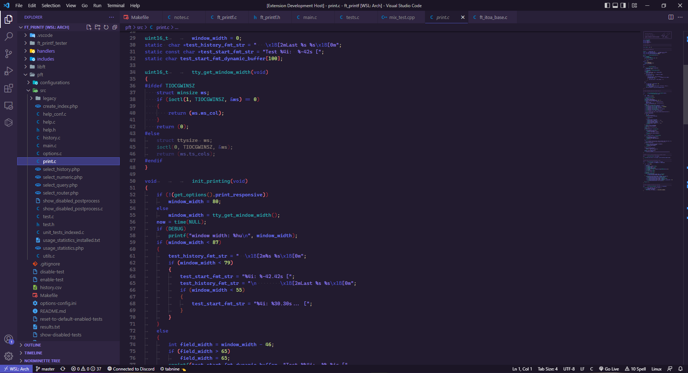
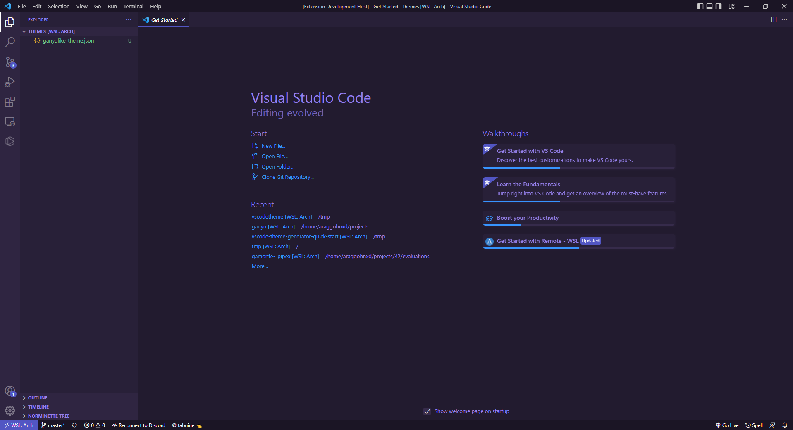
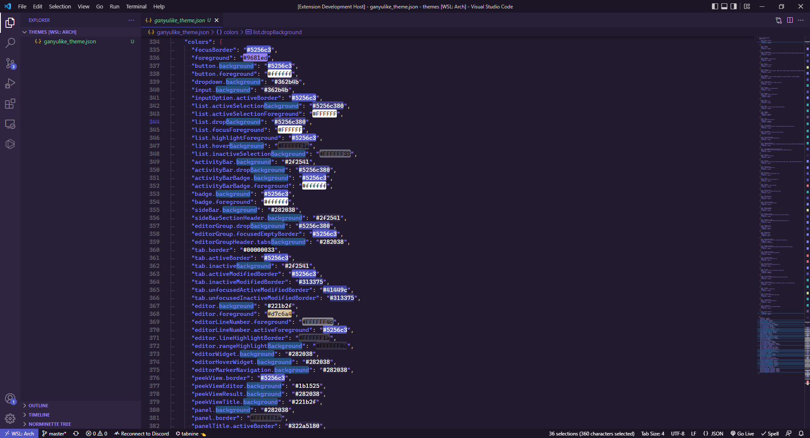

# About the Ganyulike Theme

- Guess I just wanted my VSCode to match my Terminal. That's pretty much it. <br>
- The colors in this theme are inspired by resyfer's Windows Terminal theme, called "Ganyu" (he's a fellow Genshin player).
- This is my first ever VSCode theme and I didn't really put that much effort into it. I code mostly in C, so it's probably very clunky for C and even clunkier for other languages.
- Hope you enjoy it!

<br>

## Installation

This theme is not currently on VSCode's Extesion Marketplace. I may or may not put it there. I'm that lazy. Until then, follow these steps:

1. Clone this repository;
1. Jump into the directory where you cloned it;
1. Run ```code --install-extension ganyulike-theme-0.0.1.vsix```;
1. Go to your Preferences > Color Theme > Ganyulike Theme;
1. Done!

#



